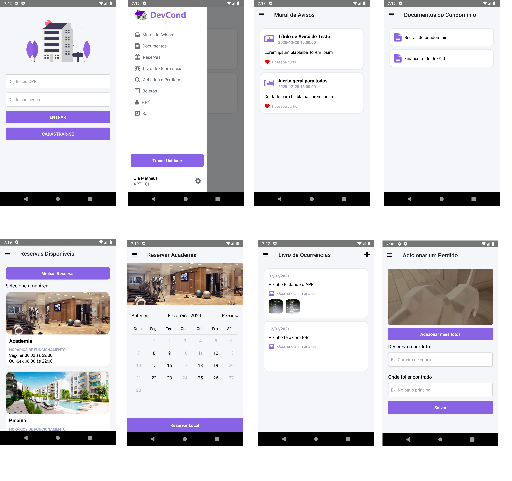

<h1 align="center">
    
    <br>Gestão de condominio (DevCond)<br/>
</h1> 

<p align="center">
  <a href="#bookmark-sobre">Sobre</a>&nbsp;&nbsp;&nbsp;|&nbsp;&nbsp;&nbsp;
  <a href="#rocket-tecnologias">Tecnologias</a>&nbsp;&nbsp;&nbsp;|&nbsp;&nbsp;&nbsp;
  <a href="#boom-como-executar">Como Executar</a>&nbsp;&nbsp;&nbsp;|&nbsp;&nbsp;&nbsp;
</p>

## :bookmark: Sobre
**A api está rodando em um servidor e está sendo consumida no app então a instalação do backend é opcional.**

O **Projeto** é um sistema de gestão de condominio e foi feito para treinar habilidades com a biblioteca **React Native** e o framework **Laravel**.

## :rocket: Tecnologias
-  [React Native](http://facebook.github.io/react-native/)
-  [Laravel](https://laravel.com/)

## :boom: Como Executar

- ### **Pré-requisitos**

  - É **necessário** possuir o **[Git](https://git-scm.com/)** instalado e configurado no computador
  - Também, é **preciso** ter um gerenciador de pacotes seja o **[NPM](https://www.npmjs.com/)** ou **[Yarn](https://yarnpkg.com/)**.
  - Também, é **preciso** ter um gerenciador de dependencias para php **[COMPOSER](https://getcomposer.org/)**

  Faça um clone do repositório:

```sh
  $ git clone https://github.com/matheuspdias/devcond.git
```

 - Passo a passo de como executar o aplicativo: https://github.com/matheuspdias/devcond/blob/main/devcondapp/README.md
 - Passo a passo de como executar o back-end: https://github.com/matheuspdias/devcond/blob/main/devcondapi/README.md
 
 **Obs: você pode usar o seguinte usuario registrado para teste.** 

**CPF: 12345678911**

**PASSWORD: 1234**

